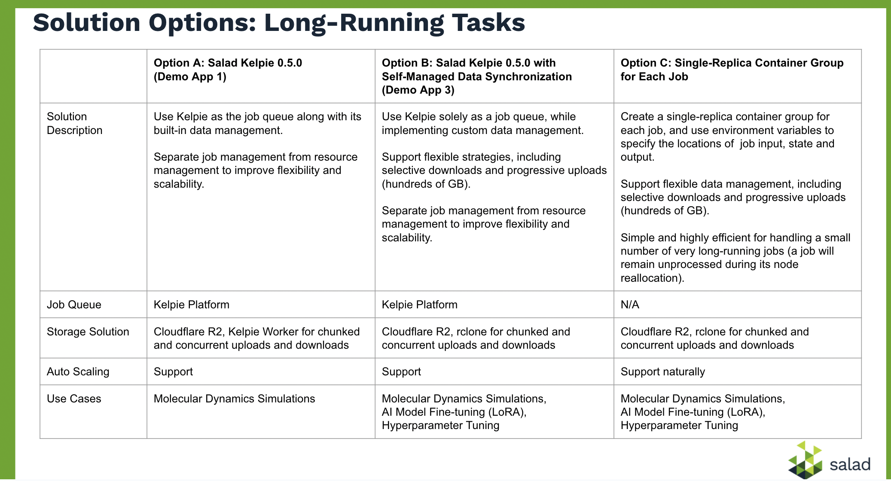

# Long-Running Tasks on SaladCloud

This repository provides resources for molecular dynamics simulations and other long-running tasks (such as model fine-tuning and hyperparameter tuning) on SaladCloud. 
It includes blogs, reference designs, benchmarking code, demonstration applications, and test reports.

If you are new to SaladCloud, we recommend starting with [the SCE Architectural Overview](https://docs.salad.com/products/sce/getting-started/architectual-overview) and [the Docker Run on SaladCloud](https://docs.salad.com/tutorials/docker-run). The tutorials - [Build High-Performance Applications](https://docs.salad.com/tutorials/high-performance-apps) and [Build High-Performance Storage Solutions](https://docs.salad.com/tutorials/high-performance-storage-solutions) share best practices along with proven insights from customers who have successfully built large-scale AI inference applications and run molecular dynamics simulations, using tens to thousands of Salad GPU nodes.

### [Long-Running Tasks - Solution Overview](https://docs.salad.com/guides/long-running-tasks/solution-overview) 

### GROMACS [Benchmark](https://blog.salad.com/gromacs-benchmark/) and [Code](https://github.com/SaladTechnologies/mds/tree/main/gromacs-benchmark)

### OpenMM [Benchmark](https://blog.salad.com/openmm-gpu-benchmark/) and [Code](https://github.com/SaladTechnologies/mds/tree/main/openmm-benchmark)

### Transcription [Benchmark](https://blog.salad.com/ai-batch-transcription-benchmark/), [Guide](https://docs.salad.com/guides/transcription/sce/youtube) and [Code](https://github.com/SaladTechnologies/yt-1m-hours-transcription-test/tree/main) for 1 Million Hours of YouTube Videos

### Long-Running Tasks - [Demo App 1](https://github.com/SaladTechnologies/mds/tree/main/demo-app1) 

Use Kelpie as the job queue along with its built-in data management.

### Long-Running Tasks - [Demo App 3](https://github.com/SaladTechnologies/mds/tree/main/demo-app3)

Use Kelpie solely as a job queue, while implementing custom data management (Cloudflare R2 + rclone).

Demo App 3 outperforms Demo App 2 (v2) in several key areas:
- **Simplified Architecture:** It significantly reduces application complexity by eliminating the need for job and leasing management, resulting in a 30% reduction (600 to 400 lines in Python) in the demo app.

- **Enhanced Task Duration:** It resolves the limitation of AWS SQS's maximum 12-hour job execution at a time, enabling seamless support for longer-running tasks on SaladCloud.

### Long-Running Tasks - [Demo App 2 (v2)](https://github.com/SaladTechnologies/mds/tree/main/demo-app2v2) 

Use AWS SQS as a job queue, while implementing custom data management (Cloudflare R2 + boto3).
Work for jobs running less than 12 hours.

### [High-Performance Inference Server](https://github.com/SaladTechnologies/mds/tree/main/inference-server)

This implementation utilizes separate threads for I/O operations (including health checks) and AI inference, enabling efficient handling of concurrent requests with batched inference processing.
It can be used for image generation, transcription, and non-streaming LLM tasks.

### [High-Performance Storage](https://github.com/SaladTechnologies/mds/tree/main/high-performance-storage)

Benchmarks and best practices for designing a high-performance and cost-effective storage solution for applications on SaladCloud.

### [High-Performance Applications](https://docs.salad.com/tutorials/high-performance-apps)

Summarize the common challenges while migrating workloads from Hyperscalers to SaladCloud, and best practices for successful application deployments.

