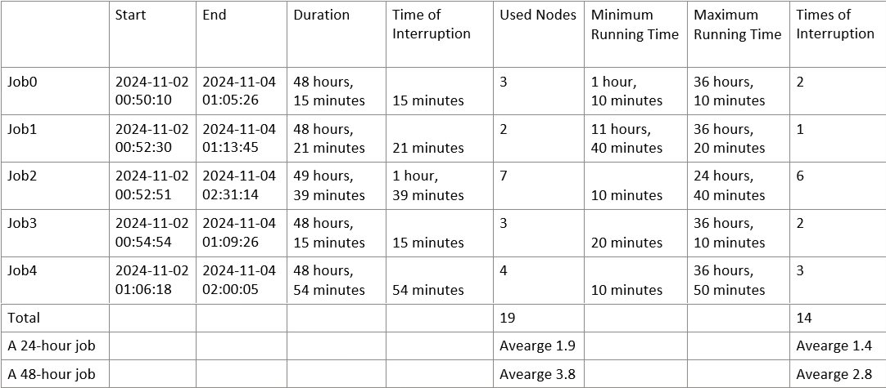

### Introduction

This demo app is designed to run long-running tasks on SaladCloud (GPU Compute) using Salad Kelpie (Job Queue + built-in data management) and Cloudflare R2 (Cloud Storage).

Here is the test result and analysis with 5 jobs with each running 48 hours: all jobs have been completed successfully, and the final results are accurate.



Please refer to [the specifications for Kelpie 0.4.4](specs_kelpie_0.4.4.png) and [the detailed test data](test_result_kelpie_5_jobs_each_48_hours.txt).

It consists of two parts:

(1)The image - The application to be run on SaladCloud (or local), which includes both the Kelpie worker (executable) and the application code.

The Kelpie worker retrieves jobs — such as calculating the sum of the series from start to end — from the Kelpie platfrom (a cloud service), runs the code and manages data synchronization using AWS S3 API, and returns the job results to the Kelpie platfrom.

The code calculates the sum of the series, which could take long time (a few hours or days) and may be interrupted during the job execution. So, it saves the current state at specific intervals (configurable) to ensure progress is preserved. When a node is down and another node takes the unfinished job, the code needs to resume the previous state and continue the execution.

Please refer to [the system architecture and referrence design](https://github.com/SaladTechnologies/mds/blob/main/SCE_Architectural_Overview/5_long_running_tasks.png) for the application.

For testing, you can run this image locally while still utilizing the Kelpie platform.

You need the access to the Kelple platform and a bucket in Cloudflare R2 (AWS S3 Compatible) to run this image.

```
export KELPIE_API_URL=https://kelpie.saladexamples.com
export KELPIE_API_KEY=<GET_A_KEY_FROM_SALAD>
export AWS_ENDPOINT_URL=https://************.r2.cloudflarestorage.com
export AWS_REGION=auto
export AWS_ACCESS_KEY_ID=************
export AWS_SECRET_ACCESS_KEY=************
```

(2)The client, provides several tools (example code) to interact with the cloud storage - Cloudflare R2 and the job queue - the Kelpie platform.

1_upload_job_input.py, upload the job inputs to cloud storage.

2_submit_job.py, submit jobs to the Kelpie platform, and keeps the job IDs in the job_history.txt file.

7_queue_job.py, query job status (PENDING, RUNNING, FAILED, COMPLETED) from the Kelpie platform using the job IDs.

8_download_job_output.py, download the job outputs from cloud storage after all jobs are finished.

Before a test, you need to reset the environment:

0_cloud_storage_remove.py, purge the previous job data (input, state and output) in cloud storage.

0_job_queue_remove.py, remove the previous jobs from the Kelpie platform.

During a test, you can check the cloud storage in real time:

0_cloud_strorage_check.py, show the contect in cloud stroage.


You can manage all the settings in the config.py file:

The CONTAINER_GROUP_ID ensures that jobs submitted to the Kelpie platform are processed only by instances within a specific container group. It must match the actual SALAD_CONTAINER_GROUP_ID when running the image on SaladCloud. You can retrieve this ID (using env command) by logging into any running instance on SaladCloud.

If you run the image locally,  the CONTAINER_GROUP_ID in the config.py file needs to match the environment variable - SALAD_CONTAINER_GROUP_ID used while running the image.

### Referrence

To integrate the Kelpie worker (the latest version is 0.4.4) to your app and use the Kelpie API: 

https://github.com/SaladTechnologies/kelpie

The example to integrate the Kelpie worker with an OpenMM application:

https://github.com/SaladTechnologies/openmm

The Kelpie platform (a cloud service) : 

https://github.com/SaladTechnologies/kelpie-api


### Run the image locally

The SALAD_CONTAINER_GROUP_ID needs to match the CONTAINER_GROUP_ID used by the client. You can assign any name for the SALAD_MACHINE_ID. When running multiple instances locally, each instance should have a unique SALAD_MACHINE_ID.

```
docker run --rm --gpus all -it \
-e KELPIE_API_URL=$KELPIE_API_URL \
-e KELPIE_API_KEY=$KELPIE_API_KEY \
-e AWS_ENDPOINT_URL=$AWS_ENDPOINT_URL \
-e AWS_REGION=$AWS_REGION \
-e AWS_ACCESS_KEY_ID=$AWS_ACCESS_KEY_ID \
-e AWS_SECRET_ACCESS_KEY=$AWS_SECRET_ACCESS_KEY \
-e SALAD_CONTAINER_GROUP_ID='LOCAL_TEST' \
-e SALAD_MACHINE_ID='LOCAL_001' \
docker.io/saladtechnologies/mds:demo-app1
```

### Run the image on SaladCloud

The SALAD_CONTAINER_GROUP_ID and the SALAD_MACHINE_ID will be automatcially assigned by SaladCloud.

```
Image Source: docker.io/saladtechnologies/mds:demo-app1
Replica Count & Resource Types,  based on requirements
Environment Variables:
KELPIE_API_URL: https://kelpie.saladexamples.com
KELPIE_API_KEY: <GET_A_KEY_FROM_SALAD>
AWS_ENDPOINT_URL: https://************.r2.cloudflarestorage.com
AWS_REGION: auto
AWS_ACCESS_KEY_ID: ************
AWS_SECRET_ACCESS_KEY: ************
```

### Build and push the container image

```
docker image build -t docker.io/saladtechnologies/mds:demo-app1 -f Dockerfile .
docker push docker.io/saladtechnologies/mds:demo-app1
docker rm -f $(docker container ps -aq)
docker rmi $(docker images -f dangling=true -q)
```