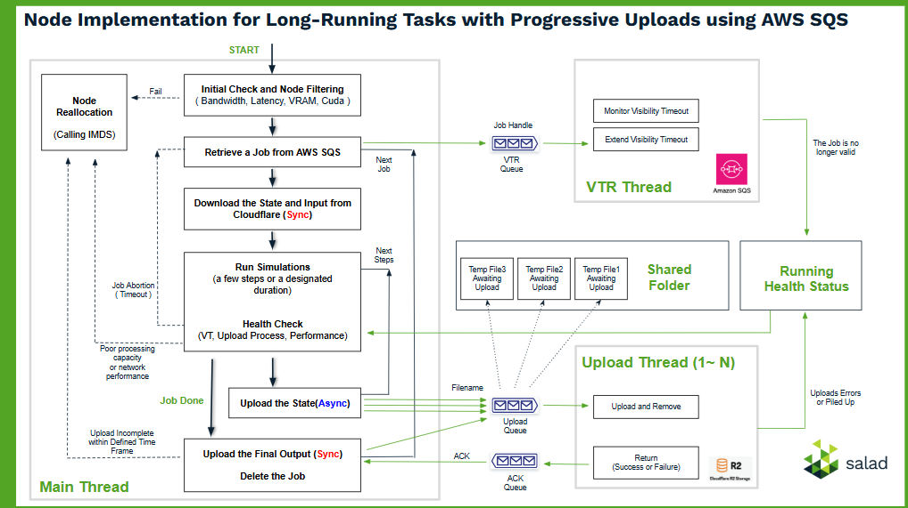

### Introduction

This demo app is designed to run long-running tasks on SaladCloud (GPU Compute) using AWS SQS (Job Queue) and Cloudflare R2 (AWS S3-Compatible Cloud Storage).

Here is [the test result and analysis with 5 jobs with each running 20 hours](test_result_analysis_5_jobs_each_20_hours.txt).

Please refer to [the system architecture and referrence design](https://github.com/SaladTechnologies/mds/blob/main/SCE_Architectural_Overview/5_long_running_tasks.png) for the application.

Its consists of two parts:

(1)The image - The application, designed to run on SaladCloud (or locally), is integrated with AWS SDK for Python (Boto3) to interact with AWS SQS and Cloudflare R2 directly.

It operates using 3 threads and 3 local queues:



The main thread retrieves jobs from AWS SQS, where each job involves calculating the sum of a numerical series over a given range. Job inputs (defined in the jobs) are downloaded from Cloudflare R2. This calculation process can be long-running, sometimes taking hours or even days, and may be interrupted during execution.

To ensure progress is not lost, the current state of a job is saved at regular, configurable intervals. When saving the state, the main thread writes the state to a temporary file and sends the file's name to the upload queue. The upload thread (or multiple upload threads) retrieves the temporary file name from the upload queue and uploads the file to Cloudflare R2, allowing the main thread to continue its calculations without interruption.

If a node goes down and another node picks up the unfinished job, the main thread on the new node can resume from the last saved state file and continue the execution seamlessly.

For the final output upload, the main thread must wait for an acknowledgment from the upload thread through the ack queue before retrieving the next job.

The visibility timeout renewal (vtr) thread receives the job handle from the main thread via the vtr queue. This thread monitors and extends the job's visibility timeout in AWS SQS, ensuring that the job remains valid while it is being processed.

After completing a few steps of simulation or a designated interval, and before saving the state, the main thread checks the job and system health status:

- If the job is no longer valid, it aborts execution to avoid conflicts since other nodes may begin processing the job.

- If there are upload errors, a backlog of uploads, or significantly low processing capacity, it terminates the job execution and triggers node reallocation.

For testing, you can run this image locally while still utilizing AWS SQS and Cloudflare R2.

You need the access to AWS SQS and a bucket in Cloudflare R2 to run this image.

```
export QUEUE_URL=https://sqs.us-east-2.amazonaws.com/************/rx-test.fifo
export AWS_ID=************
export AWS_KEY=************
export CLOUDFLARE_URL=https://************.r2.cloudflarestorage.com
export CLOUDFLARE_REGION=auto
export CLOUDFLARE_ID=************
export CLOUDFLARE_KEY=************
```

(2)The client, provides several tools (example code) to interact with the cloud storage - Cloudflare R2 and the job queue - AWS SQS.

```
1_upload_job_input.py, upload the job inputs to Cloudflare R2.
2_submit_job.py, submit a batch of jobs to AWS SQS.
7_queue_job.py, query the job queue - the available job number and the number of jobs that are being processed.
8_download_job_output.py, download the logs and outputs from cloud storage after all jobs are finished.

Before a test, you need to reset the environment:
0_cloud_storage_remove.py, purge the previous job data (input, state and output) in cloud storage.
0_job_queue_remove.py, remove the all jobs in AWS SQS.

During a test, you can check the cloud storage in real time:
0_cloud_strorage_check.py, show the contect in cloud stroage.

You can manage all the settings in the config.py file.
```

### Use Cases / Relevant Scenarios

With this solution, the application code has full visibility into the runtime environment, including processing capacity and network conditions. This enables seamless optimization, from initial checks to real-time performance monitoring and adaptive algorithms, enhancing efficiency, throughput, and reliability.

Since AWS SQS doesn’t provide a way to query the status of individual jobs, we can monitor their status directly from the cloud storage instead.

### Run the image locally

```
docker run --rm --gpus all -it \
-e QUEUE_URL=$QUEUE_URL \
-e AWS_ID=$AWS_ID \
-e AWS_KEY=$AWS_KEY \
-e CLOUDFLARE_URL=$CLOUDFLARE_URL \
-e CLOUDFLARE_REGION=$CLOUDFLARE_REGION \
-e CLOUDFLARE_ID=$CLOUDFLARE_ID \
-e CLOUDFLARE_KEY=$CLOUDFLARE_KEY \
docker.io/saladtechnologies/mds:demo-app2v2 
```

```
docker run --rm --gpus all -it -e QUEUE_URL=$QUEUE_URL -e AWS_ID=$AWS_ID -e AWS_KEY=$AWS_KEY -e CLOUDFLARE_URL=$CLOUDFLARE_URL -e CLOUDFLARE_REGION=$CLOUDFLARE_REGION -e CLOUDFLARE_ID=$CLOUDFLARE_ID -e CLOUDFLARE_KEY=$CLOUDFLARE_KEY docker.io/saladtechnologies/mds:demo-app2v2 /bin/bash
```

### Run the image on SaladCloud

```
Image Source: docker.io/saladtechnologies/mds:demo-app2v2
Replica Count & Resource Types, based on requirements
Environment Variables:
QUEUE_URL: https://sqs.us-east-2.amazonaws.com/************/rx-test.fifo
AWS_ID: ************
AWS_KEY: ************
CLOUDFLARE_URL: https://************.r2.cloudflarestorage.com
CLOUDFLARE_REGION: auto
CLOUDFLARE_ID: ************
CLOUDFLARE_KEY: ************
```

### Build and push the container image

```
docker image build -t docker.io/saladtechnologies/mds:demo-app2v2 -f Dockerfile .
docker push docker.io/saladtechnologies/mds:demo-app2
docker rm -f $(docker container ps -aq)
docker rmi $(docker images -f dangling=true -q)
```