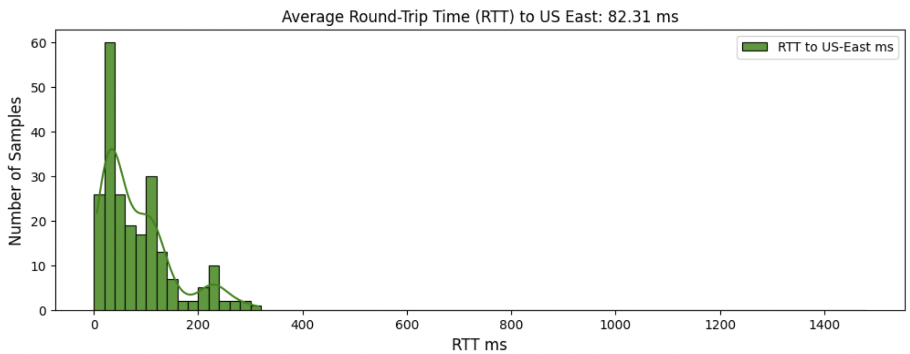
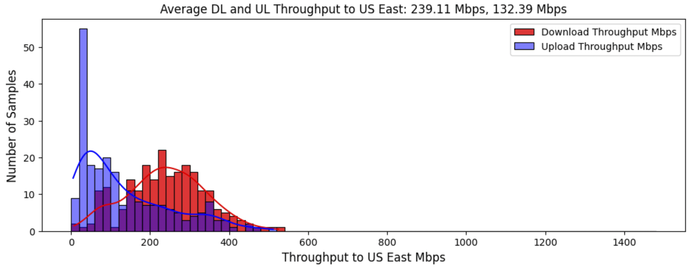
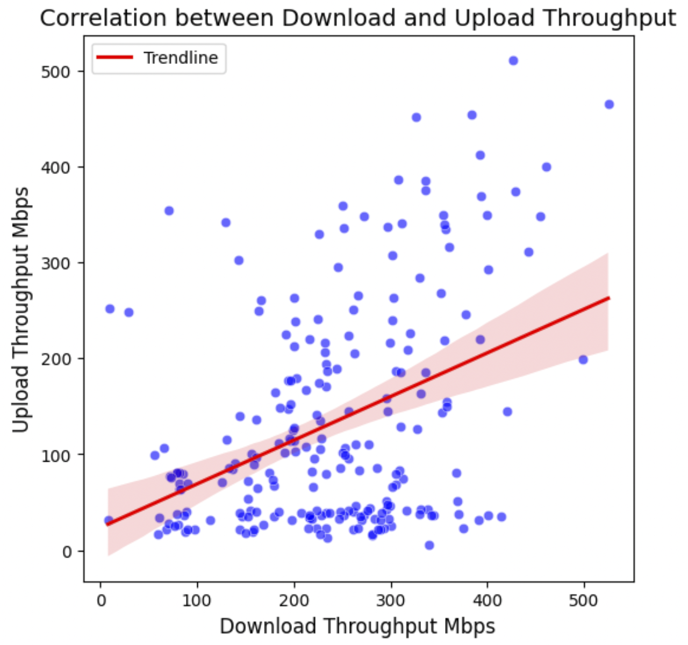

### High Performance Storage

SCE provides a GPU-enabled container environment for running containerized applications. When a container group is stopped or nodes are reallocated, all images and associated runtime data are removed from the previously allocated nodes. To ensure data persistence, external cloud storage must be used.

However, volume mounting using S3FS, FUSE or NFS is not supported, as SCE containers do not run in privileged mode. The recommended solution is to install and use the Cloud Storage SDK or CLI (e.g., azcopy, aws s3 or gsutil) within the container images to sync data from cloud storage.

Consider using open-source tools like [rclone](https://rclone.org/) or [s3parcp](https://github.com/chanzuckerberg/s3parcp) to optimize performance and throughput. These tools support chunked parallel downloads and uploads, allowing for more efficient utilization of physical bandwidth by leveraging multiple connections.

The following factors should be taken into account when designing a high-performance storage solution for SCE workloads:

- Selecting nodes with higher physical bandwidth, minimizing round-trip time by optimizing network distance and latency to specific locations, and leveraging multiple connections are key strategies for improving TCP performance and throughput.

- Transmission efficiency generally improves with larger data volumes. In certain scenarios, compressing a large number of small files into a single large file can help increase throughput.

- Many Salad nodes are located in residential networks with asymmetric bandwidth, where the upload speed is lower than the download speed.

- Salad nodes are not evenly distributed across regions and countries, with nodes in the US and Canada accounting for 50~60% of the total. Deploying workloads that require specific resource types in a limited number of countries may result in insufficient node availability.

- Some cloud providers charge for egress traffic, while ingress traffic is typically free. We recommend a vendor (such as Cloudflare R2) that does not charge egress fees, as Salad nodes are globally distributed and egress fees can add up quickly.

### SaladCloud Network and Storage Benchmark Using Cloudflare R2 and rclone

Over 200 Salad nodes are used for the test, around 60% in US and Canada, with each providing an upload bandwidth of 20+ Mbps and a download bandwidth of 50+ Mbps (via the node filtering). 

Every node transfers 200 MiB of data—both uploading and downloading—from a Cloudflare R2 bucket located in the US East region. The data transfer using rclone is configured with a chunk size of 10 MiB, sending 10 chunks simultaneously. 

RTT is primarily influenced by the distance and latency between the nodes and US East:



Throughput is determined by the end-to-end physical bandwidth, RTT and the size of transferred data (200 MiB in this test):



The asymmetric bandwidth of SaladCloud is noticeable, but many nodes are still capable of providing good upload throughput:



### Integrate Cloudflare R2 and rclone in your container images

This [Dockerfile](Dockerfile) sets up a containerized environment using the PyTorch base image with GPU support. It installs rclone and the necessary dependencies, and copies the Python scripts into the image. When the container is run, it starts the benchmark test.

[config.py](config.py), provides the example code to create the rclone configuration file based on the environment variables and manage data synchronization between Cloudflare R2 and local. It just runs rclone commands using the subprocess module, here are some example:

```
rclone lsf r2:transcripts/high_performance_storage # Lists files and directories 
rclone cat r2:transcripts/high_performance_storage/results/LOCAL_001.txt # Outputs the file content
rclone deletefile r2:transcripts/high_performance_storage/results/LOCAL_001.txt # Deletes the file
rclone serve webdav r2:transcripts/ --addr :8888 # Serves the bucket as a WebDAV server
```

[benchmark.py](benchmark.py), creates a temporary file, transfers it between Cloudflare R2 and the local environment, and saves the final result back to Cloudflare R2.

Build and push the image:
```
docker image build -t docker.io/saladtechnologies/mds:hps -f Dockerfile .
docker push docker.io/saladtechnologies/mds:hps
docker rm -f $(docker container ps -aq)
docker rmi $(docker images -f dangling=true -q)
```

You need the access to a bucket in Cloudflare R2 to run this image:
```
export CLOUDFLARE_ENDPOINT_URL=https://************.r2.cloudflarestorage.com
export CLOUDFLARE_REGION=auto
export CLOUDFLARE_ID=************
export CLOUDFLARE_KEY=************
export BUCKET=transcripts              # bucket
export FOLDER=high_performance_storage # foler
export SIZE=200   # MiB, the size of transferred data
export ULSPEED=20 # Mbps
export DLSPEED=50 # Mbps
```

Run the image locally:
```
docker run --rm --gpus all -it \
-e CLOUDFLARE_ENDPOINT_URL=$CLOUDFLARE_ENDPOINT_URL \
-e CLOUDFLARE_REGION=$CLOUDFLARE_REGION \
-e CLOUDFLARE_ID=$CLOUDFLARE_ID \
-e CLOUDFLARE_KEY=$CLOUDFLARE_KEY \
-e SALAD_MACHINE_ID='LOCAL_001' \
-e BUCKET=$BUCKET \
-e FOLDER=$FOLDER \
-e SIZE=$SIZE \
-e ULSPEED=$ULSPEED \
-e DLSPEED=$DLSPEED \
```

When you run the image locally, the container stops when the code finishes executing. 

On SaladCloud, however, a new node will be allocated to run the image again once the code exits. By keeping a container group with a few replicas running for some time on SaladCloud, you can gather test data from many Salad nodes.
