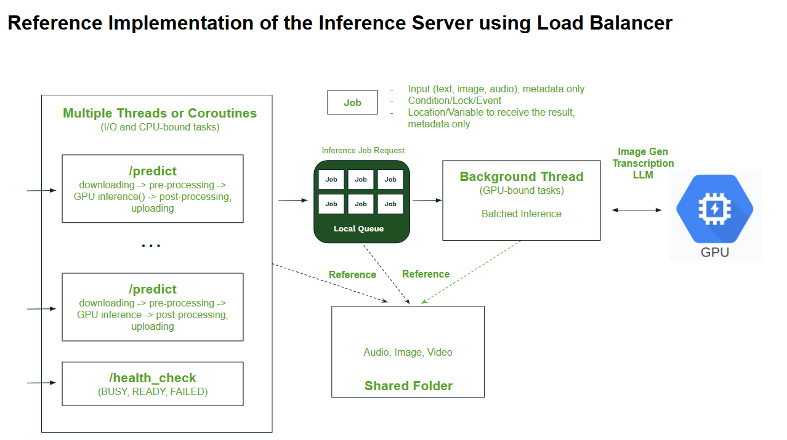

## Reference Implementation of Inference Servers running on SaladCloud

This demo app offers a reference implementation of inference servers in both Python and TypeScript, deployed on SaladCloud.

## Use the container gateway (load balancer)

To enhance overall performance and throughput, [the container gateway typically utilizes multiple connections to each instance and sends multiple requests to the instance concurrently](https://docs.salad.com/products/sce/gateway/load-balancer-options#concurrency).

For inference servers, it’s ideal to design them to handle multiple simultaneous requests efficiently. Key features should include a local queue to buffer incoming requests, the ability to accept new requests and respond to health checks during GPU inference, and a back-pressure mechanism to reject requests when the queue is full. Additionally, the server should support batched inference dynamically grouping incoming requests to optimize processing. 

In contrast to batched or single inference, using multiprocessing or multithreading for concurrent inference on a single GPU may limit optimal GPU cache utilization and negatively impact performance; therefore, this approach should generally be avoided.

### [server_flask_counter.py](python_app/server_flask_counter.py)

This Python code implements a Flask server designed to handle inference requests efficiently with batch processing, back-pressure mechanisms, and real-time health monitoring, making it well-suited for high-demand inference workloads. Below is a summary of the key features:

- Request Queue with Length Control

Uses a queue to store incoming requests, with a counter and lock to maintain the queue's length accurately.

The MAX_QUEUE_LENGTH variable limits the number of pending requests, rejecting any requests when the queue is full with an appropriate error message.

- Batch Processing

A batch_processor function runs on a separate daemon thread (terminating when the main program exits), grouping incoming requests every interval or until the batch size is reached, and then processes them with a delay,  simulating a batched inference operation and optimizing the GPU resource utilization.

The PROCESS_INTERVAL and BATCH_SIZE variables define the interval at which requests are grouped and the maximum batch size for each inference.

- Request Handling

Each incoming request spawns a dedicated thread to manage request tasks, such as downloading, pre-processing, enqueueing and waiting for GPU inference, post-processing, uploading and response handling.

Each request in the queue contains the input, a Condition object for synchronization and a list to store results.

After processing, the batch processor uses the Condition object associated with each job to notify all waiting request threads, enabling them to retrieve their results and continue the post-processing. 

- Health Check Endpoint

Provides a health check endpoint /health_check running on a separate thread, ensuring it remains unaffected by GPU inference tasks. The endpoint returns a status of "busy" if the queue is full and "ready" otherwise.

You can further customize the functionality, adding more status or simply returning OK.

Due to Python's Global Interpreter Lock (GIL), concurrent execution of Python bytecode is restricted to a single thread within a process. This can create bottlenecks in CPU-bound tasks (like pre- and post-processing) and reduce parallel efficiency. Additionally, using multiple threads can increase scheduling overhead.

### [server_fastapi_count_2_threads.py](python_app/server_fastapi_count_2_threads.py)

This Python code implements a FastAPI-based version of the previously discussed Flask server, efficiently handling inference requests through a mix of asynchronous and synchronous processing.

Since GPU inference (typically using frameworks like TensorFlow or PyTorch) often involves blocking operations, it is not fully compatible with asynchronous execution. To address this, a dedicated background thread is used to handle batched inference.

The main thread manages all other tasks asynchronously, including request handling, enqueueing and waiting, and health checks, ensuring minimal blocking and optimal performance.

Requests are placed into a Janus queue, which ensures thread-safe communication between the asynchronous FastAPI handlers and the synchronous batch processing thread. Additionally, thread-safe events are used for synchronization between the main and batch processing threads.

Compared to the Flask version, this implementation utilizes only two threads, significantly reducing multithreading scheduling overhead and optimizing parallel execution efficiency. 

To further enhance performance, the application can be optimized by using two separate processes: one for handling CPU and I/O-bound tasks, and another dedicated to GPU inference. This process-based architecture can minimize contention for resources and improve scalability, resulting in a more efficient and responsive system.

### [server_express.ts](typescript_app/src/server_express.ts)

TypeScript/JavaScript with Node.js can seamlessly execute commands, making them an effective coordinator for AI inference tasks. By integrating with backend systems, managing request queues, and orchestrating AI model execution, they provide a flexible and efficient environment for controlling and coordinating inference processes.

The TypeScript code sets up a basic Express server that efficiently queues incoming requests and processes them in batches. It enforces a queue limit to prevent server overload, handles requests asynchronously, and provides a health check endpoint to monitor the server's status. The batching mechanism reduces the overhead of processing requests individually, improving overall system performance and responsiveness, especially under high demand.

## Use a job queue

With a job queue, the inference server can be optimized to focus solely on GPU inference, while an I/O worker process handles all other tasks, such as pulling jobs, renewing leases, downloading inputs, pre-processing, invoking the GPU inference, post-processing, uploading outputs, returning job results, and deleting jobs. This clear separation of concerns allows the system to run more efficiently.

When the application handles only one job at a time, the I/O worker process can operate with a single thread, performing tasks sequentially. 

However, if throughput is a priority and the application needs to handle multiple jobs concurrently, a multi-threaded approach with local queues can be employed. This approach uses a multi-pipeline, staged architecture where GPU inference remains sequential, but other tasks run in parallel. For example, while Job 1 is being post-processed/uploaded and Job 3 is downloaded/pre-processed, Job 2 can be processed by the GPU, significantly increasing resource utilization and overall system throughput.

Please check this link for [further details](https://docs.salad.com/guides/transcription/sce/youtube#node-implementation-on-saladcloud-using-parakeet-tdt-1-1b) and [the example code](https://github.com/SaladTechnologies/yt-1m-hours-transcription-test/tree/main/node).
